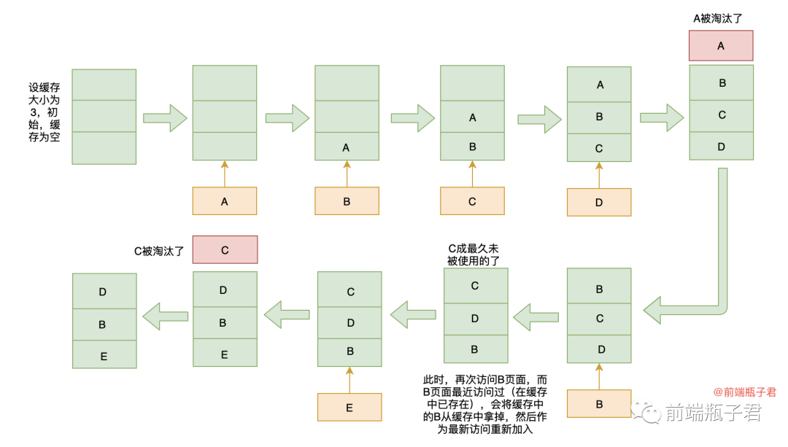

  [从浏览器缓存淘汰策略和Vue的keep-alive学习LRU算法](https://mp.weixin.qq.com/s/er5-zl3FKMAyvhx6xui7jQ)
#### 一、LRU 缓存淘汰策略
缓存在计算机网络上随处可见，例如：当我们首次访问一个网页时，打开很慢，但当我们再次打开这个网页时，打开就很快。
这就涉及缓存在浏览器上的应用：浏览器缓存。

当我们打开一个网页时，例如 https://github.com/sisterAn/JavaScript-Algorithms ，它会在发起真正的网络请求前，
查询浏览器缓存，看是否有要请求的文件，
如果有，浏览器将会拦截请求，返回缓存文件，并直接结束请求，不会再去服务器上下载。如果不存在，才会去服务器请求。

其实，浏览器中的缓存是一种在本地保存资源副本，它的大小是有限的，当我们请求数过多时，缓存空间会被用满，
此时，继续进行网络请求就需要确定缓存中哪些数据被保留，哪些数据被移除，
这就是浏览器缓存淘汰策略，最常见的淘汰策略有 FIFO（先进先出）、LFU（最少使用）、LRU（最近最少使用）。

LRU （ Least Recently Used ：最近最少使用 ）缓存淘汰策略，
故名思义，就是根据数据的历史访问记录来进行淘汰数据，
其核心思想是 如果数据最近被访问过，那么将来被访问的几率也更高 ，优先淘汰最近没有被访问到的数据。

  
    二、LRU 在 keep-alive (Vue) 上的实现
    1. keep-alive
keep-alive 在 vue 中用于实现组件的缓存，当组件切换时不会对当前组件进行卸载。  
```html
  <!-- 基本 -->
  <keep-alive>
    <component :is="view"></component>
  </keep-alive>
```
最常用的两个属性：include 、 exculde ，
用于组件进行有条件的缓存，可以用逗号分隔字符串、正则表达式或一个数组来表示。
在 2.5.0 版本中，keep-alive 新增了 max 属性，
用于最多可以缓存多少组件实例，一旦这个数字达到了，
在新实例被创建之前，已缓存组件中最久没有被访问的实例会被销毁掉，
看，这里就应用了 LRU 算法。
即在 keep-alive 中缓存达到 max，新增缓存实例会优先淘汰最近没有被访问到的实例

下面我们透过 vue 源码看一下具体的实现
#### 2. 从 vue 源码看 keep-alive 的实现
```javascript
      exportdefault {
        name: "keep-alive",
        // 抽象组件属性 ,它在组件实例建立父子关系的时候会被忽略,
        // 发生在 initLifecycle 的过程中
        abstract: true,
        props: {
          // 被缓存组件
          include: patternTypes,
          // 不被缓存组件
          exclude: patternTypes,
          // 指定缓存大小
          max: [String, Number]
        },
        created() {
          // 初始化用于存储缓存的 cache 对象
          this.cache = Object.create(null);
          // 初始化用于存储VNode key值的 keys 数组
          this.keys = [];
        },
        destroyed() {
          for (const key inthis.cache) {
            // 删除所有缓存
            pruneCacheEntry(this.cache, key, this.keys);
          }
        },
        mounted() {
          // 监听缓存（include）/不缓存（exclude）组件的变化
          // 在变化时，重新调整 cache
          // pruneCache：遍历 cache，
          //   如果缓存的节点名称与传入的规则没有匹配上的话，
          //   就把这个节点从缓存中移除
          this.$watch("include", val => {
            pruneCache(this, name => matches(val, name));
          });
          this.$watch("exclude", val => {
            pruneCache(this, name => !matches(val, name));
          });
        },
        render() {
          // 获取第一个子元素的 vnode
          const slot = this.$slots.default;
          const vnode: VNode = getFirstComponentChild(slot);
          const componentOptions: ?VNodeComponentOptions =
            vnode && vnode.componentOptions;
          if (componentOptions) {
            // name 不在 inlcude 中或者在 exlude 中则直接返回 vnode，
            // 否则继续进行下一步
            // check pattern
            const name: ?string = getComponentName(componentOptions);
            const { include, exclude } = this;
            if (
              // not included
              (include && (!name || !matches(include, name))) ||
              // excluded
              (exclude && name && matches(exclude, name))
            ) {
              return vnode;
            }
            
            const { cache, keys } = this;
            // 获取键，优先获取组件的 name 字段，否则是组件的 tag
            const key: ?string =
              vnode.key == null
                ? // same constructor may get registered as
                  // different local components
                  // so cid alone is not enough (#3269)
                  componentOptions.Ctor.cid +
                  (componentOptions.tag ? `::${componentOptions.tag}` : "")
                : vnode.key;
              
            // --------------------------------------------------
            // 下面就是 LRU 算法了，
            // 如果在缓存里有则调整，
            // 没有则放入（长度超过 max，则淘汰最近没有访问的）
            // --------------------------------------------------
            // 如果命中缓存，则从缓存中获取 vnode 的组件实例，
            // 并且调整 key 的顺序放入 keys 数组的末尾
            if (cache[key]) {
              vnode.componentInstance = cache[key].componentInstance;
              // make current key freshest
              remove(keys, key);
              keys.push(key);
            }
            // 如果没有命中缓存,就把 vnode 放进缓存
            else {
              cache[key] = vnode;
              keys.push(key);
              // prune oldest entry
              // 如果配置了 max 并且缓存的长度超过了 this.max，还要从缓存中删除第一个
              if (this.max && keys.length > parseInt(this.max)) {
                pruneCacheEntry(cache, keys[0], keys, this._vnode);
              }
            }
            
            // keepAlive标记位
            vnode.data.keepAlive = true;
          }
          return vnode || (slot && slot[0]);
        }
      };
      
      // 移除 key 缓存
      function pruneCacheEntry (
        cache: VNodeCache,
        key: string,
        keys: Array<string>,
        current?: VNode
      ) {
        const cached = cache[key]
        if (cached && (!current || cached.tag !== current.tag)) {
          cached.componentInstance.$destroy()
        }
        cache[key] = null
        remove(keys, key)
      }
      
      // remove 方法（shared/util.js）
      /**
       * Remove an item from an array.
       */
      exportfunction remove (arr: Array<any>, item: any): Array<any> | void {
        if (arr.length) {
          const index = arr.indexOf(item)
          if (index > -1) {
            return arr.splice(index, 1)
          }
        }
      }
```
在 keep-alive 缓存超过 max 时，使用的缓存淘汰算法就是 LRU 算法，它在实现的过程中用到了 cache 对象用于保存缓存的组件实例及 key 值，keys 数组用于保存缓存组件的 key ，当 keep-alive 中渲染一个需要缓存的实例时：

判断缓存中是否已缓存了该实例，缓存了则直接获取，并调整 key 在 keys 中的位置（移除 keys 中 key ，并放入 keys 数组的最后一位）
如果没有缓存，则缓存该实例，若 keys 的长度大于 max （缓存长度超过上限），则移除 keys[0] 缓存
